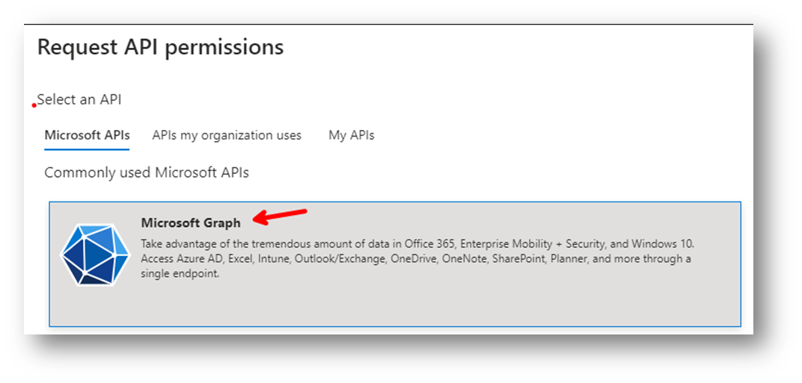
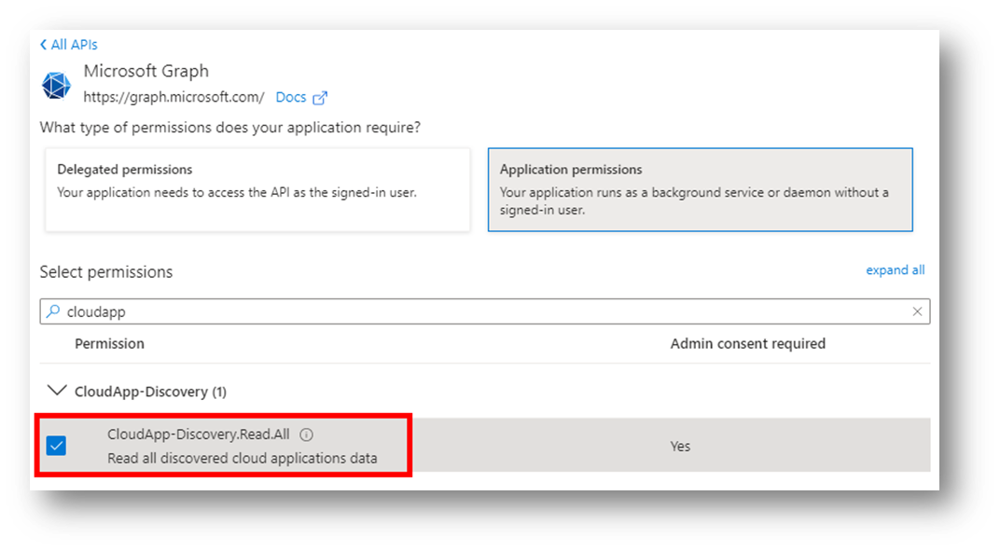
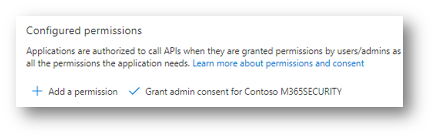
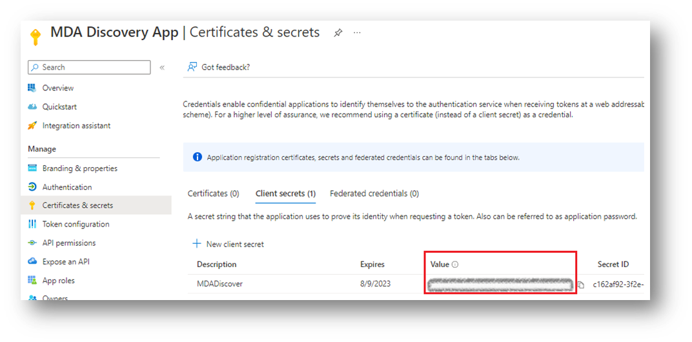

# Discovered Apps API via Microsoft Graph

### Contacts
| Name | Role          |
| --------------- | -- |
| Itai Cohen      | PM |
| Douglas Santos  | PM |
| Keith Fleming   | PM |


## Background:
This API will allow customers to GET all the data available in Discovered Apps page via an API; including filters, ‘select’ (https://learn.microsoft.com/en-us/graph/query-parameters?tabs=http#odata-system-query-options) and more. 

## Basic Features Functionality:
1.	Run the following GET command to get an high-level summary of the Discovery streams enabled on your tenant: 
https://graph.microsoft.com/beta/security/dataDiscovery/cloudAppDiscovery/uploadedStreams
  
  
2. Copy the relevant 'streamId': 
  
    

3.	Run the following GET command using the 'streamId':
  
  ```HTML 
  GET https://graph.microsoft.com/beta/security/dataDiscovery/cloudAppDiscovery/uploadedStreams/<streamId>/aggregatedAppsDetails(period=duration'P90D')
  ```
  
### Permissions Requirements: 
| Permissions	| Type	| Entities/APIs Covered |
| --- | --- | --- |
| CloudApp-Discovery.Read.All	| Read Discovered Apps data.	| Allows the app to read all available data pertaining to Discovered Cloud Apps from Microsoft Defender for Cloud Apps.|
  
## Top Use Cases and Examples
### See all the apps discovered this week: 

#### Code or REST operation example:
```HTML 
GET  https://graph.microsoft.com/beta/security/dataDiscovery/cloudAppDiscovery/uploadedStreams/<streamId>/aggregatedAppsDetails(period=duration'P7D') 
```

Expected response:
```JSON
Response:{
  "value": [
    {
      "@odata.type": "#microsoft.security.DiscoveredCloudAppDetail",
      "id": 13203423542,
      "displayName": "Microsoft Exchange Online",
      "riskScore": 10,
      "totalNetworkTrafficInBytes": 243453345,
      "uploadNetworkTrafficInBytes": 934564,
      "downloadNetworkTraficInBytes": 242518781,
      "transactionCount": 52,
      "userCount": 49,
      "ipAddressCount": 33,
      "lastSeenDateTime": "2022-08-14",
      "tags": ["Sanctioned"],
      "category": "Marketing",
      "domains": ["*.outlook.office.com", "*.outlook.office365.com", "*.mail.onmicrosoft.com", "*.o365weve.com",...]      
    },
    { "id": 845938765493, "displayName": "Dropbox", "riskScore": 9 }
  ]
}
```
#### Using $select, and $filter see only the app name of all the apps discovered in the last 30 days with risk score lower or equal to 4:
```HTML 
GET https://graph.microsoft.com/beta/security/dataDiscovery/cloudAppDiscovery/uploadedStreams/<streamId>/aggregatedAppsDetails(period=duration'P30D')?$filter=riskScore le 4 &$select=displayName 
```

Expected response:
```JSON
  Response:{
    "value": [
      {"displayName": "ShareASale"},
      {"displayName": "PubNub"}
    ]
}
```
#### Get the userIdentifier of all users (or devices or IPaddresses) using a specific app

```HTML 
GET  https://graph.microsoft.com/beta/security/dataDiscovery/cloudAppDiscovery/uploadedStreams/<streamId>/aggregatedAppsDetails(period=duration'P30D')/<id>/users 
```

Expected response:

```JSON
Response:{
  "value": [
    { "userIdentifier": "Broderick@fabrikan.com"}, {" userIdentifier": "temp@fabrikan.com"}
  ]
}
```
*same for a collection of entities called Collection(discoveredCloudAppsipAddress) with 1 property called "ipAddress"

*[Currently not supported - known issue to be fixed in mid-July] same for a collection of entities called Collection(discoveredCloudAppsDevice) with 1 property called "name". Note applicable only if the stream is Endpoint Stream.

#### Using filters, see all apps which are categorized as Marketing and are not Hipaa or GDPR compliant

*Note if Defender for Endpoint stream is used, "deviceCount" will be presented as well

*Note Currently AppInfo (Hipaa and GDPR in the below example) is not supported - known issue to be fixed by mid-July

```HTML
GET  https://graph.microsoft.com/beta/security/dataDiscovery/cloudAppDiscovery/uploadedStreams/<endpointStreamId>/aggregatedAppsDetails(period=duration'P30D')?$filter=(appInfo/isHipaaCompliant eq 'false' or appInfo/isGdprDataProtectionImpactAssessment eq 'false') and category eq 'Marketing'
```

Expected response:

```JSON
Response:
{
  "value": [
    {
      "@odata.type": "#microsoft.security.endpointDiscoveredCloudAppDetail",
      "id": 13203423542,
      "displayName": "Microsoft Exchange Online",
      "riskScore": 10,
      "totalNetworkTrafficInBytes": 243453345,
      "uploadNetworkTrafficInBytes": 934564,
      "downloadNetworkTraficInBytes": 242518781,
      "transactionCount": 52,
      "userCount": 49,
      "deviceCount": 37,
      "ipAddressCount": 33,
      "lastSeenDateTime": "2022-08-14",
      "tags": ["Sanctioned"],
      "category": "Marketing",
      "domains": ["*.outlook.office.com", "*.outlook.office365.com", "*.mail.onmicrosoft.com", "*.o365weve.com",...]      

    },
    { "id": 845938765493, "displayName": "Dropbox", "riskScore": 9 }
  ]
}
```
#
# Using Graph API
## Best practices of how to use Graph API
### Here are the steps to register an Azure AD app with these permissions, if you want to test this with a script such as PowerShell:

### 1. Create an App using either [Application Context](https://learn.microsoft.com/en-us/defender-cloud-apps/api-authentication-application) or [User Context](https://learn.microsoft.com/en-us/defender-cloud-apps/api-authentication-user) and give it consent.
In general, you’ll need to take the following steps to use the APIs:
 
* Create an Azure Active Directory (Azure AD) application
* Get an access token using this application
* Use the token to access the Defender for Cloud Apps API

Steps (1 to 3): To create an App in Azure AD, follow the steps 1, 2 and 3 on this documentation
https://learn.microsoft.com/en-us/defender-cloud-apps/api-authentication-application#create-an-app
 
When you get to step 4 on, use the instructions below instead of the steps in the public doc.
You will need to customize the permissions needed for managing Cloud Discovery
 
### 2. Under Microsoft Graph, give permission to the CloudApp-Discovery.Read.All 



### 3. Grant Admin Consent to the App


### 4. Get an app secret under "Certificates & Secrets" and copy the string under “value” to be used by your script later on
Note: You can also use certificates
 
  
### 5. Now you configure your script/code to use the authorized App to query the API.
 Powershell sample:
 [Placeholder]

### 6. [Optional] Integrate with PBI 
 [Placeholder]


#
# **Details and schema changes**

## New entity types
###  *DiscoveredCloudAppDetail*  
| Property        | Type           | Description  |
| ------------- |:-------------:| -----:|
| id      | String | The unique identifier for the discovered cloud app. |
| displayName	| String	| The name of the app (no restriction) |
| tags	| List of Strings	| A list of all the tags of an app. Usually it ranges between 0 to 2 but theoretically can have up to 15 custom tags| 
|riskScore|Int|The risk score of the app: 10 means secure, 1 means very risky|
|uploadNetworkTraficInBytes|Int32|The amount of upload traffic in bytes|
|downloadNetworkTraficInBytes|Int32|The amount of download traffic in bytes|
|transactionCount|Int|number of the transactions; a transaction is one log line of usage between two devices. i.e, any request to the SaaS app is a transaction, so if the user browse the app and then clicked on a link inside the app it is counted as 2 transactions|
|userCount|Int|the number of all the users who browsed this app|
|ipAddressCount|Int|The number of IP Addresses that were browsed to this app|
|lastSeenDateTime|Date|When was the app last browsed. format YYYY-MM-DD|
|domains|List of Strings|A list of all domains/URLs associated to this app. List length can be any number between 1 to 55.|
|category|appCategory|This field describes what category an app is in. An app can be part of a single category only. Categories examples: Marketing, Social Media, Collaboration.|


###  *Relationships* 
| Property        | Type           | Description  |
| ------------- |:-------------:| -----:|
| users | Collection(discoveredCloudAppsUser) | the email of the user|
| ipAddresses | Collection(discoveredCloudAppsipAddress) | the discovered IP address|
| appInfo | discoveredCloudAppsAppInfo | the 90 parameters which determine the risk score of the app|

###  *Supported functionality* 
|Operation | Supported | Method | Success | Notes |
| ------------- |:-------------:| -----:| -----:| -----:|
|List | Yes | `GET` | 200 OK | |
|Get | Yes | `GET` | 200 OK | |


###  *Supported query patterns* 
| Pattern        | Supported  |  Syntax | Notes  |
| ------------- |:-------------:| -----:| -----:|
|Server-side pagination| Yes | `@odata.nextLink` | |
| Filter 1 - equals | Yes | `/collection?$filter=propA eq 'value'` | propA can be: id, displayName, tags, riskScore, traffic, transactionCount, userCount, ipAddressCount, lastSeenDateTime, domains, and all appInfo parameters*, with value1 according to property type.|
| Filter 2 - not equals | Yes | `/collection?$filter=propA ne 'value'` | propA can be: id, displayName, tags, riskScore, traffic, transactionCount, userCount, ipAddressCount, lastSeenDateTime, domains, and all appInfo parameters*, with value1 according to property type.|
| Filter 3 - in range | Yes | `/collection?$filter=propA le 'value1' and propA ge 'value2''` |propA can be: riskScore, traffic, uploadNetworkTraficInBytes, downloadNetworkTraficInBytes, transactionCount, userCount, ipAddressCount, lastSeenDateTime, and all appInfo parameters* of type int or date, , with value1 and value2 as int, date or float according to property.|
| Filter 4 - less than or equal | Yes | `/collection?$filter=propA le 'value'` | propA can be: riskScore, traffic, uploadNetworkTraficInBytes, downloadNetworkTraficInBytes, transactionCount, userCount, ipAddressCount, lastSeenDateTime, and all appInfo parameters* of type int or date, with value1 as int or float according to property. propA can be: lastSeen with value1 as date.|
| Filter 5 - greater than or equal | Yes | `/collection?$filter=propA ge 'value'` | propA can be: riskScore, traffic, uploadNetworkTraficInBytes, downloadNetworkTraficInBytes, transactionCount, userCount, ipAddressCount, lastSeenDateTime, and all appInfo parameters* of type int or date, with value1 as int or float according to property. propA can be: lastSeen with value1 as date.|
| Filter 6 - starts with | Yes | `/collection?$filter=startswith(propA, 'value')` | propA can be: displayName, tags, domains, appInfo/* all strings parameters |
| Filter 7 - end with | Yes | `/collection?$filter=endswith(propA, 'value')` | propA can be: displayName, tags, domains, appInfo/* all strings parameters |
| Filter 8 - contains text | Yes | `/collection?$filter=contains(propA, 'value')` | propA can be: displayName, tags, domains, appInfo/* all strings parameters |
| expand user property | Yes | `/collection?$expand=users` | |

##### Supported query patterns

| Pattern                             | Supported | Syntax                                                         | Notes                                                                                                                                                                                                                                                                                                       |
| ----------------------------------- | :-------: | -------------------------------------------------------------- | ----------------------------------------------------------------------------------------------------------------------------------------------------------------------------------------------------------------------------------------------------------------------------------------------------------- |
| Server-side pagination              |     ✓     | `@odata.nextLink`                                              |                                                                                                                                                                                                                                                                                                             |
| Filter 1 - equals                   |     ✓     | `/collection?$filter=propA eq 'value'`                         | propA can be: id, displayName, riskScore, traffic, transactionCount, userCount, ipAddressCount, lastSeenDateTime, category, and all appInfo parameters\*, with value1 according to property type.                                                                                                      |
| Filter 2 - not equals               |     ✓     | `/collection?$filter=propA ne 'value'`                         | propA can be: id, displayName, riskScore, traffic, transactionCount, userCount, ipAddressCount, category, and all appInfo parameters\*, with value1 according to property type.                                                                                                                                 |
| Filter 3 - in range                 |     ✓     | `/collection?$filter=propA le 'value1' and propA ge 'value2' ` | propA can be: riskScore, traffic, uploadNetworkTraficInBytes, downloadNetworkTraficInBytes, transactionCount, userCount, ipAddressCount, lastSeenDateTime, and all appInfo parameters\* of type int or date, , with value1 and value2 as int, date or float according to property.                          |
| Filter 4 - less than or equal to    |     ✓     | `/collection?$filter=propA le 'value'`                         | propA can be: riskScore, traffic, uploadNetworkTraficInBytes, downloadNetworkTraficInBytes, transactionCount, userCount, ipAddressCount, lastSeenDateTime, and all appInfo parameters\* of type int or date, with value1 as int or float according to property. propA can be: lastSeen with value1 as date. |
| Filter 5 - greater than or equal to |     ✓     | `/collection?$filter=propA ge 'value'`                         | propA can be: riskScore, traffic, uploadNetworkTraficInBytes, downloadNetworkTraficInBytes, transactionCount, userCount, ipAddressCount, lastSeenDateTime, and all appInfo parameters\* of type int or date, with value1 as int or float according to property. propA can be: lastSeen with value1 as date. |
| Filter 6 - starts with              |     ✓     | `/collection?$filter=startswith(propA, value)`                 | propA can be: displayName, tags, domains, appInfo/\* all strings parameters                                                                                                                                                                                                                                 |
| Filter 7 - end with                 |     ✓     | `/collection?$filter=endsWith(propA, value)`                   | propA can be: displayName, tags, domains, appInfo/\* all strings parameters                                                                                                                                                                                                                                 |
| Filter 8 - contains text            |     ✓     | `/collection?$filter=contains(propA, value)`                   | propA can be: displayName, tags, domains, appInfo/\* all strings parameters                                                                                                                                                                                                                                 |
| expand - user property              |     ✓     | `/collection?$expand=users `                                   |                                                                                                                                                                                                                                                                                                             |


#### discoveredCloudAppsUser

##### Properties

| Property       | Type   | Description                    | Key | Required | ReadOnly |
| -------------- | ------ | ------------------------------ | --- | -------- | -------- |
| userIdentifier | String | A unique identifier for a user | Yes | Yes      | Yes      |

| Operation | Supported | Method | Success | Notes |
| --------- | :-------: | ------ | ------- | ----- |
| List      |     ✓     | `GET`  | `200`   |       |
| Get       |     ✓     | `GET`  | `200`   |       |

##### Supported query patterns

| Pattern                | Supported | Syntax                                                     | Notes |
| ---------------------- | :-------: | ---------------------------------------------------------- | ----- |
| Server-side pagination |     ✓     | `@odata.nextLink`                                          |       |
| Filter - equals        |     ✓     | `/collection?$filter=userIdentifier eq 'jane@example.com'` |       |

#### discoveredCloudAppsIPAddress

##### Properties

| Property  | Type   | Description         | Key | Required | ReadOnly |
| --------- | ------ | ------------------- | --- | -------- | -------- |
| ipAddress | String | A unique IP Address | Yes | Yes      | Yes      |

| Operation | Supported | Method | Success | Notes |
| --------- | :-------: | ------ | ------- | ----- |
| List      |     ✓     | `GET`  | `200`   |       |
| Get       |     ✓     | `GET`  | `200`   |       |

##### Supported query patterns

| Pattern                | Supported | Syntax                                         | Notes |
| ---------------------- | :-------: | ---------------------------------------------- | ----- |
| Server-side pagination |     ✓     | `@odata.nextLink`                              |       |
| Filter - equals        |     ✓     | `/collection?$filter=ipAddress eq 'exampleIP'` |       |

### discoveredCloudAppsDevice

##### Properties

| Property | Type   | Description                 | Key | Required | ReadOnly |
| -------- | ------ | --------------------------- | --- | -------- | -------- |
| name     | String | A unique name of the device | Yes | Yes      | Yes      |

| Operation | Supported | Method | Success | Notes |
| --------- | :-------: | ------ | ------- | ----- |
| List      |     ✓     | `GET`  | `200`   |       |
| Get       |     ✓     | `GET`  | `200`   |       |

##### Supported query patterns

| Pattern                | Supported | Syntax                                  | Notes |
| ---------------------- | :-------: | --------------------------------------- | ----- |
| Server-side pagination |     ✓     | `@odata.nextLink`                       |       |
| Filter - equals        |     ✓     | `/collection?$filter=name eq 'example'` |       |

#### discoveredCloudAppInfo

##### Properties

| Property                                          | Type                              | Description                                                                                                                                                                                                                                               | Key   | Required   | ReadOnly   |
| ------------------------------------------------- | --------------------------------- | --------------------------------------------------------------------------------------------------------------------------------------------------------------------------------------------------------------------------------------------------------- | ----- | ---------- | ---------- |
| isGdprDataProtectionImpactAssessment              | cloudAppInfoState                 | Describes whether a Data Protection Impact Assesment was performed for this app                                                                                                                                                                           | No    | Yes        | Yes        |
| isGdprDataProtectionSecureCrossBorderDataTransfer | cloudAppInfoState                 | Does this app comply with GDPR cross boarder data transfer requirement, which defines whether the app securly transfer data across borders                                                                                                                | No    | Yes        | Yes        |
| isHttpSecurityHeadersContentSecurityPolicy        | cloudAppInfoState                 | Is this HTTPs header implemented by this app?                                                                                                                                                                                                             | No    | Yes        | Yes        |
| isHttpSecurityHeadersStrictTransportSecurity      | cloudAppInfoState                 | Is this HTTPs header implemented by this app?                                                                                                                                                                                                             | No    | Yes        | Yes        |
| isHttpSecurityHeadersXContentTypeOptions          | cloudAppInfoState                 | Is this HTTPs header implemented by this app?                                                                                                                                                                                                             | No    | Yes        | Yes        |
| isHttpSecurityHeadersXFrameOptions                | cloudAppInfoState                 | Is this HTTPs header implemented by this app?                                                                                                                                                                                                             | No    | Yes        | Yes        |
| isHttpSecurityHeadersXXssProtection               | cloudAppInfoState                 | Is this HTTPs header implemented by this app?                                                                                                                                                                                                             | No    | Yes        | Yes        |
| isTrustedCertificate                              | cloudAppInfoState                 | Does the server provide a trusted SSL certificate (not expired, verified and trusted signature chain, etc.)?                                                                                                                                              | No    | Yes        | Yes        |
| isValidCertificateName                            | cloudAppInfoState                 | Does the server provide an SSL certificate matching the domain name?                                                                                                                                                                                      | No    | Yes        | Yes        |
| isCoppaCompliant                                  | cloudAppInfoState                 | Does this app comply with COPPA, which defines requirements on website and online services operators that provide content to children under 13 years of age?                                                                                              |  No   |  Yes       |  Yes       |
| isFerpaCompliant                                  | cloudAppInfoState                 | Does this app comply with FERPA, a federal law that protects the privacy of student education records?                                                                                                                                                    |  No   |  Yes       |  Yes       |
| isFfiecCompliant                                  | cloudAppInfoState                 | Does this app comply with the Federal Financial Institutions Examination Council's guidance on the risk management controls necessary to authenticate services in an Internet banking environment?                                                        |  No   |  Yes       |  Yes       |
| isFinraCompliant                                  | cloudAppInfoState                 | Does this app comply with FINRA, a standard set for not-for-profit organizations authorized by Congress that regulates and enforces the enhancement of investor safeguards and market integrity?                                                          |  No   |  Yes       |  Yes       |
| isFismaCompliant                                  | cloudAppInfoState                 | Does this app comply with FISMA, the US legislation that defines a comprehensive framework to protect government information, operations and assets within federal agencies, against threats?                                                             |  No   |  Yes       |  Yes       |
| isGaapCompliant                                   | cloudAppInfoState                 | Does this app comply with GAAP, a collection of commonly-followed accounting rules and standards for financial reporting?                                                                                                                                 |  No   |  Yes       |  Yes       |
| isGdprDataProtectionOfficer                       | cloudAppInfoState                 | Does this app appoint a data protection officer to oversee data security strategy and GDPR compliance?                                                                                                                                                    |  No   |  Yes       |  Yes       |
| isGdprImpactAssessment                            | cloudAppInfoState                 | Does this app conduct data protection impact assessments to identify risk to individuals?                                                                                                                                                                 |  No   |  Yes       |  Yes       |
| isGdprLawfulBasisForProcessing                    | cloudAppInfoState                 | Does this app process personal data lawfully in accordance with consent, contract, legal obligation, vital interests, legitimate interests, special category, data, and criminal offense data?                                                            |  No   |  Yes       |  Yes       |
| isGdprReportDataBreaches                          | cloudAppInfoState                 | Does this app report data breaches to supervisory authorities and individuals affected by the breach, within 72 hours of breach detection?                                                                                                                |  No   |  Yes       |  Yes       |
| isGdprRightToAccess                               | cloudAppInfoState                 | Does this app provide individuals with the ability to know, upon request, what personal data a company is using and how it is being used?                                                                                                                 |  No   |  Yes       |  Yes       |
| isGdprRightToBeInformed                           | cloudAppInfoState                 | Does this app inform individuals of the appropriate safeguards it takes when personal data is transferred to a non-EU country/region or to an international organization?                                                                                 |  No   |  Yes       |  Yes       |
| isGdprRightToDataPortablility                     | cloudAppInfoState                 | Does this app provide individuals with the ability to obtain and reuse their personal data for their own purposes across different services upon request?                                                                                                 |  No   |  Yes       |  Yes       |
| isGdprRightToErasure                              | cloudAppInfoState                 | Does this app stop processing and delete an individual's personal data upon request?                                                                                                                                                                      |  No   |  Yes       |  Yes       |
| isGdprRightToObject                               | cloudAppInfoState                 | Does this app provide individuals with the ability to object to the processing of their personal data in certain circumstances?                                                                                                                           |  No   |  Yes       |  Yes       |
| isGdprRightToRectification                        | cloudAppInfoState                 | Does this app provide individuals with the ability to rectify their personal data? The controller must respond to all requests from its data subjects within one month.                                                                                   |  No   |  Yes       |  Yes       |
| isGdprRightToRestrictionOfProcessing              | cloudAppInfoState                 | Does this app provide individuals with the ability to block or suppress processing of personal data?                                                                                                                                                      |  No   |  Yes       |  Yes       |
| isGdprRightsRelatedToAutomatedDecisionMaking      | cloudAppInfoState                 | Does this app provide individuals with the ability to choose not to be subject to a decision that is based solely on automated processing? This includes profiling, which may have legal ramifications.                                                   |  No   |  Yes       |  Yes       |
| isGdprSecureCrossBorderDataControl                | cloudAppInfoState                 | Does this app securely transfer data across borders?                                                                                                                                                                                                      |  No   |  Yes       |  Yes       |
| isGlbaCompliant                                   | cloudAppInfoState                 | Does this app comply with the Gramm-Leach-Bliley Act (GLBA), which requires financial institutions to establish standards for protecting the security and confidentiality of customers' personal information?                                             |  No   |  Yes       |  Yes       |
| isHipaaCompliant                                  | cloudAppInfoState                 | Does this app comply with HIPAA, the US legislation that sets standards for protecting the confidentiality and security of individually identifiable health information?                                                                                  |  No   |  Yes       |  Yes       |
| isHitrustCsfCompliant                             | cloudAppInfoState                 | Does this app comply with HITRUST CSF, a set of controls that harmonizes the requirements of information security regulations and standards?                                                                                                              |  No   |  Yes       |  Yes       |
| isIsae3402Compliant                               | cloudAppInfoState                 | Does this app comply with ISAE 3402, the global standard providing assurance that a service organization has appropriate controls in place?                                                                                                               |  No   |  Yes       |  Yes       |
| isIso27018Compliant                               | cloudAppInfoState                 | Does this app comply with ISO 27018, which establishes commonly accepted controls and guidelines for processing and protecting Personally Identifiable Information (PII) in a public cloud computing environment?                                         |  No   |  Yes       |  Yes       |
| isItarCompliant                                   | cloudAppInfoState                 | Does this app comply with ITAR, regulations controlling the export and import of defense-related articles and services found on the US Munitions List?                                                                                                    |  No   |  Yes       |  Yes       |
| isPrivacyShieldCompliant                          | cloudAppInfoState                 | Does this app comply with the EU-US Privacy Shield Framework, which imposes stronger obligations on US companies to protect Europeans' personal data?                                                                                                     |  No   |  Yes       |  Yes       |
| isSoc1Compliant                                   | cloudAppInfoState                 | Does this app comply with SOC 1, reporting on controls at a service organization which are relevant to user entities' internal control over financial reporting?                                                                                          |  No   |  Yes       |  Yes       |
| isSoxCompliant                                    | cloudAppInfoState                 | Does this app comply with SOX, US legislation aimed at protecting shareholders and the general public from accounting errors and frauds, as well as improving the accuracy of corporate disclosures?                                                      |  No   |  Yes       |  Yes       |
| isSsae16Compliant                                 | cloudAppInfoState                 | Does this app comply with the SSAE 16 standard for auditing a service organization's internal compliance controls and reporting processes?                                                                                                                |  No   |  Yes       |  Yes       |
| dataTypes                                         | appInfoUploadedDataTypes          | Which data types can be uploaded by the user to the app?                                                                                                                                                                                                  |  No   |  Yes       |  Yes       |
| csaStarLevel                                      | appInfoCsaStarLevel               | The level of CSA STAR program at which the app is certified                                                                                                                                                                                               |  No   |  Yes       |  Yes       |
| fedRampLevel                                      | appInfoFedRampLevel               | The level of the FedRAMP-compliant solution provided by this app.                                                                                                                                                                                         |  No   |  Yes       |  Yes       |
| pciDssVersion                                     | appInfoPciDssVersion              | The version of the PCI-DSS protocol supported by this app.                                                                                                                                                                                                |  No   |  Yes       |  Yes       |
| dataAtRestEncryptionMethod                        | appInfoDataAtRestEncryptionMethod | The type of encryption of data-at-rest performed on the app.                                                                                                                                                                                              |  No   |  Yes       |  Yes       |
| holding                                           | appInfoHolding                    | Displays whether the provider is a publicly or privately held company                                                                                                                                                                                     |  No   |  Yes       |  Yes       |
| tlsEncryptionProtocol                             | appInfoTlsEncryptionProtocol      | The encryption protocol used.                                                                                                                                                                                                                             |  No   |  Yes       |  Yes       |
| dataCenter                                        | String Collection                 | The country/region in which your data center resides (can be multiple locations), using ISO 3166 two letters country codes                                                                                                                                |  No   |  Yes       |  Yes       |
| headquarters                                      | Country code                      | The country/region of the provider's headquarters.                                                                                                                                                                                                        |  No   |  Yes       |  Yes       |
| founded                                           | Integer                           | The year in which the provider was founded.                                                                                                                                                                                                               |  No   |  Yes       |  Yes       |
| isAdminAuditTrail                                 | cloudAppInfoState                 | Does this app support availability of an admin audit trail in the app?                                                                                                                                                                                    |  No   |  Yes       |  Yes       |
| isCobitCompliant                                  | cloudAppInfoState                 | Does this app comply with COBIT, which sets best practices for the governance and control of information systems and technology, and aligns IT with business principles?                                                                                  |  No   |  Yes       |  Yes       |
| isDataAuditTrail                                  | cloudAppInfoState                 | Does this app support availability of a data audit trail in the app?                                                                                                                                                                                      |  No   |  Yes       |  Yes       |
| isDataClassification                              | cloudAppInfoState                 | Does this app enable the option for classification of the data uploaded to the app?                                                                                                                                                                       |  No   |  Yes       |  Yes       |
| isDataOwnership                                   | cloudAppInfoState                 | Does this app fully preserve the user's ownership of uploaded data?                                                                                                                                                                                       |  No   |  Yes       |  Yes       |
| dataRetentionPolicy                               | appInfoDataRetentionPolicy        | What is the app's policy for user data retention after account termination?                                                                                                                                                                               |  No   |  Yes       |  Yes       |
| isDisasterRecoveryPlan                            | cloudAppInfoState                 | Does this app have a disaster recovery plan that includes a backup and restore strategy?                                                                                                                                                                  |  No   |  Yes       |  Yes       |
| isDmca                                            | cloudAppInfoState                 | Does this app comply with the Digital Millennium Copyright Act (DMCA), which criminalizes any attempt to unlawfully access copyrighted material?                                                                                                          |  No   |  Yes       |  Yes       |
| isFileSharing                                     | cloudAppInfoState                 | Does this app include features that allow file sharing between users?                                                                                                                                                                                     |  No   |  Yes       |  Yes       |
| isIpAddressRestriction                            | cloudAppInfoState                 | Does this app support restriction of specific IP addresses by the app?                                                                                                                                                                                    |  No   |  Yes       |  Yes       |
| isIso27001Compliant                               | cloudAppInfoState                 | Is this app ISO 27001 certified, a certificate given to companies upholding internationally recognized guidelines and general principles for initiating, implementing, maintaining, and improving information security management within an organization? |  No   |  Yes       |  Yes       |
| isIso27017Compliant                               | cloudAppInfoState                 | Does this app comply with ISO 27017, which establishes commonly accepted controls and guidelines for processing and protecting user information in a public cloud-computing environment?                                                                  |  No   |  Yes       |  Yes       |
| isMultiFactorAuthentication                       | cloudAppInfoState                 | Does this app support multi-factor authentication solutions?                                                                                                                                                                                              |  No   |  Yes       |  Yes       |
| isPasswordPolicyChangePasswordPeriod              | cloudAppInfoState                 | Does this app enforce users to reset their password periodically?                                                                                                                                                                                         |  No   |  Yes       |  Yes       |
| isPasswordPolicyCharacterCombination              | cloudAppInfoState                 | Does this app enforce a character combination on password creation?                                                                                                                                                                                       |  No   |  Yes       |  Yes       |
| isPasswordPolicyPasswordHistoryAndReuse           | cloudAppInfoState                 | Does this app disallow the reuse of old passwords?                                                                                                                                                                                                        |  No   |  Yes       |  Yes       |
| isPasswordPolicyPasswordLengthLimit               | cloudAppInfoState                 | Does this app enforce a length limit on password creation?                                                                                                                                                                                                |  No   |  Yes       |  Yes       |
| isPasswordPolicyPersonalInformationUse            | cloudAppInfoState                 | Does this app disallow the use of personal information in passwords?                                                                                                                                                                                      |  No   |  Yes       |  Yes       |
| isPenetrationTesting                              | cloudAppInfoState                 | Does this app carry out penetration testing to detect and assess network vulnerabilities?                                                                                                                                                                 |  No   |  Yes       |  Yes       |
| isRememberPassword                                | cloudAppInfoState                 | Does this app enable the option for remembering and saving user passwords in the app?                                                                                                                                                                     |  No   |  Yes       |  Yes       |
| isRequiresUserAuthentication                      | cloudAppInfoState                 | Does this app require authentication and disallow anonymous use?                                                                                                                                                                                          |  No   |  Yes       |  Yes       |
| isSoc2Compliant                                   | cloudAppInfoState                 | Does this app comply with SOC 2, reporting on non-financial processing based on one or more of the Trust service criteria on security, privacy, availability, confidentiality, and processing integrity?                                                  |  No   |  Yes       |  Yes       |
| isSoc3Compliant                                   | cloudAppInfoState                 | Does this app comply with SOC 3, reporting based on the Trust service criteria, that may be distributed freely and only contain management's assertion that they have met the requirements of the chosen criteria?                                        |  No   |  Yes       |  Yes       |
| isSp80053Compliant                                | cloudAppInfoState                 | Does this app comply with SP80053, recommended security controls for federal information systems and organizations?                                                                                                                                       |  No   |  Yes       |  Yes       |
| isSupportsSaml                                    | cloudAppInfoState                 | Does this app support the SAML standard for exchanging authentication and authorization data?                                                                                                                                                             |  No   |  Yes       |  Yes       |
| isUserAuditTrail                                  | cloudAppInfoState                 | Does this app support availability of audit trail per user account?                                                                                                                                                                                       |  No   |  Yes       |  Yes       |
| isUserCanUploadData                               | cloudAppInfoState                 | Does this app support user uploaded data?                                                                                                                                                                                                                 |  No   |  Yes       |  Yes       |
| isUserRolesSupport                                | cloudAppInfoState                 | Does this app support distribution of users by roles and levels of permission?                                                                                                                                                                            |  No   |  Yes       |  Yes       |
| latestBreachDateTime                              | Date                              | Most recent incident in which sensitive, protected, or confidential data owned by the app was viewed, stolen, or used by an individual unauthorized to do so.                                                                                             |  No   |  Yes       |  Yes       |
| domainRegistrationDateTime                        | Date                              | The dte the domain was registered.                                                                                                                                                                                                                        |  No   |  Yes       |  Yes       |
| gdprReadinessStatement                            | String                            | A link to your website, when relevant, relating how this provider plans to handle GDPR compliance.                                                                                                                                                        |  No   |  Yes       |  Yes       |
| hostingCompany                                    | String                            | The name of the company that provides server hosting for the app.                                                                                                                                                                                         |  No   |  Yes       |  Yes       |
| logonUrls                                         | Collection(String)                | The URL through which users log on to the app.                                                                                                                                                                                                            |  No   |  Yes       |  Yes       |
| vendor                                            | String                            | The name of the vendor who provides this app.                                                                                                                                                                                                             |  No   |  Yes       |  Yes       |

##### CSDL
```hmml
https://msazure.visualstudio.com/One/_git/AD-AggregatorService-Workloads?path=%2FWorkloads%2FMicrosoft.DefenderForCloudApps%2Foverride%2Fschema-PPE-beta.csdl&version=GBtest%2Fmda-discoveredApps
```

### New enums

\*Note all enums below are evolvable by default.

#### cloudAppInfoState

Around 40 app info items will use this ENUM.

| Value   | Description                         |
| ------- | ----------------------------------- |
| true    | TRUE is applicable.                 |
| false   | FALSE is applicable.                |
| unknown | the state is unknown/not available. |

#### appInfoUploadedDataTypes

This field describes what data types can be uploaded to this SaaS app.
\*This is a flag enum.

| Value         | Description                     |
| ------------- | ------------------------------- |
| documents     | The data type is documents      |
| mediaFiles    | The data type is media files    |
| codingFiles   | The data type is coding files   |
| creditCards   | The data type is credit cards   |
| databaseFiles | The data type is database files |
| none          | No data type.                   |

#### appInfoCsaStarLevel

This field describes what CSA STAR level an app has.
This will be created as an evolvable ENUM.

| Value                | Description                                |
| -------------------- | ------------------------------------------ |
| selfAssessment       | The CSA star level is self assessment      |
| certification        | The CSA star level is Certification        |
| attestation          | The CSA star level is Attestation          |
| cStarAssessment      | The CSA star level is C-STAR Assessment    |
| continuousMonitoring | The CSA star level is continuousMonitoring |

#### appInfoFedRampLevel

This field describes what FedRAMP level an app has.
This will be created as an evolvable ENUM.

| Value    | Description                   |
| -------- | ----------------------------- |
| high     | The FedRAMP level is high     |
| moderate | The FedRAMP level is moderate |
| low      | The FedRAMP level is low      |
| liSaaS   | The FedRAMP level is liSaaS   |

#### appInfoPciDssVersion

This field describes what PCI DSS version an app has.
This will be created as an evolvable ENUM.

| Value   | Description                    |
| ------- | ------------------------------ |
| v1      | The PCI DSS version is 1       |
| v2      | The PCI DSS version is 2       |
| v3      | The PCI DSS version is 3       |
| v3_1    | The PCI DSS version is 3.1     |
| v3_2    | The PCI DSS version is 3.2     |
| v3_2_1  | The PCI DSS version is 3.2.1     |
| unknown | The PCI DSS version is unknown |

#### appInfoDataAtRestEncryptionMethod

This field describes what Data-at-rest encryption method an app is using.
This will be created as an evolvable ENUM.

| Value        | Description                                         |
| ------------ | --------------------------------------------------- |
| aes          | The Data-at-rest encryption method is AES           |
| bitLocker    | The Data-at-rest encryption method is bitLocker     |
| blowfish     | The Data-at-rest encryption method is Blowfish      |
| des3         | The Data-at-rest encryption method is 3DES          |
| des          | The Data-at-rest encryption method is DES           |
| rc4          | The Data-at-rest encryption method is RC4           |
| rsa          | The Data-at-rest encryption method is RSA           |
| notSupported | The Data-at-rest encryption method is not supported |
| unknown      | The Data-at-rest encryption method is unknown       |

#### appInfoHolding

This field describes what type of holding an app has.
This will be created as an evolvable ENUM.

| Value   | Description            |
| ------- | ---------------------- |
| private | The Holding is private |
| public  | The Holding is public  |

#### appInfoDataRetentionPolicy

This field describes what Encryption protocol an app is using.
This will be created as an evolvable ENUM.

| Value                             | Description                       |
| --------------------------------- | --------------------------------- |
| dataRetained                      | Data retained                     |
| deletedImmediately                | Deleted immediately               |
| deletedWithinOneMonth             | Deleted within 1 month            |
| deletedWithinTwoWeeks             | Deleted within 2 weeks            |
| deletedWithinThreeMonths          | Deleted within 3 months           |
| deletedWithinMoreThanThreeMonths  | Deleted within more than 3 months |

# appInfoTlsEncryptionProtocol

This field describes what Data Retention Policy an app is using.
This will be created as an evolvable ENUM.

| Value         | Description                              |
| ------------- | ---------------------------------------- |
| tls1_0        | The Encryption protocol is TLS 1.0       |
| tls1_1        | The Encryption protocol is TLS 1.1       |
| tls1_2        | The Encryption protocol is TLS 1.2       |
| tls1_3        | The Encryption protocol is TLS 1.3       |
| notApplicable | The Encryption protocol is N/A           |
| notSupported  | The Encryption protocol is Not supported |
#### appCategory

This field describes what category an app is in.
This will be created as an evolvable ENUM.

| Value                    | Description                                         |
| ------------------------ | --------------------------------------------------- |
| security                 | Apps that offer Security services                   |
| collaboration            | Apps that offer Collaboration services              |
| hostingServices          | Apps that offer Hosting services services           |
| onlineMeetings           | Apps that offer Online meetings services            |
| newsAndEntertainment     | Apps that offer News and entertainment services     |
| eCommerce                | Apps that offer E-commerce services                 |
| education                | Apps that offer education services                  |
| cloudStorage             | Apps that offer Cloud storage services              |
| marketing                | Apps that offer Marketing services                  |
| operationsManagement     | Apps that offer Operations Management services      |
| health                   | Apps that offer health services                     |
| advertising              | Apps that offer advertising services                |
| productivity             | Apps that offer Productivity services               |
| accountingAndFinance     | Apps that offer Accounting and finance services     |
| contentManagement        | Apps that offer Content management services         |
| contentSharing           | Apps that offer Content sharing services            |
| businessManagement       | Apps that offer Business management services        |
| communications           | Apps that offer Communications services             |
| dataAnalytics            | Apps that offer Data analytics services             |
| businessIntelligence     | Apps that offer Business intelligence services      |
| webemail                 | Apps that offer Webmail services                    |
| codeHosting              | Apps that offer Code hosting services               |
| webAnalytics             | Apps that offer Web analytics services              |
| socialNetwork            | Apps that offer Social network services             |
| crm                      | Apps that offer CRM services                        |
| forums                   | Apps that offer Forums services                     |
| humanResourceManagement  | Apps that offer Human resource management services  |
| transportationAndTravel  | Apps that offer Transportation and travel services  |
| productDesign            | Apps that offer Product design services             |
| sales                    | Apps that offer Sales services                      |
| cloudComputingPlatform   | Apps that offer Cloud computing platform services   |
| projectManagement        | Apps that offer Project management services         |
| personalInstantMessaging | Apps that offer Personal instant messaging services |
| developmentTools         | Apps that offer Development tools services          |
| itServices               | Apps that offer IT services services                |
| supplyChainAndLogistics  | Apps that offer SupplyChain and logistics services  |
| propertyManagement       | Apps that offer Property Management services        |
| customerSupport          | Apps that offer Customer Support services           |
| internetOfThings         | Apps that offer Internet of Things services         |
| vendorManagementSystems  | Apps that offer Vendor Management Systems services  |
| websiteMonitoring        | Apps that offer Website Monitoring services         |

### New actions/functions

#### aggregatedAppsDetails

##### Parameters

| Parameter          | Type                                   | Kind    | Required? | Description                                                        |
| ------------------ | -------------------------------------- | ------- | --------- | ------------------------------------------------------------------ |
| `bindingParameter` | `cloudAppDiscoveryReport`              | binding | Yes       |                                                                    |
| `period`           | `string` ISO8601 duration              | input   | Yes       | Last 7days,30days or 90days. Allowed values: 'P7D', 'P30D', 'P90D' |
|                    | collection(`discoveredCloudAppDetail`) | return  | Yes       | the entity type that is described further above                    |

## Error conditions and messages

## Permissions scopes

### API re-uses existing Graph permissions

| Permissions                   | Type                       | Entities/APIs Covered                                                                                                 |
| ----------------------------- | -------------------------- | --------------------------------------------------------------------------------------------------------------------- |
| `CloudApp-Discovery.Read.All` | Read Discovered Apps data. | Allows the app to read all available data pertaining to Discovered Cloud Apps from Microsoft Defender for Cloud Apps. |


